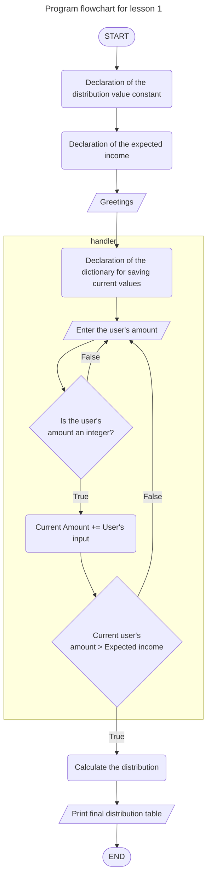

# Homework #1. Vitalii Harhai. Python online 11

## Level 1
- **Завдання: Сформулювати своє розуміння, що таке тип даних.**

Тип даних це класс відокремлених даних, який має притаманні лише йому властивості, методи та 
 операції між екземплярами цього класу.

- **Завдання: Сформулювати своє розуміння типізацій - динамічної, статичної, сильної та слабкої.**

**Види типізації по можливості зміни змінної програмістом**

- **статична** - (статичний - незмінний) тип змінної визначається при її оголошенні та не змінюється під час виконання
програми (C, Java)

- **динамічна** - (динамічний - змінювальний) тип змінної змінюється під час виконання програми (Python, JavaScript)

**Виды типізації по сприйняттю її мовою програмування**

- **сильна (сувора)** - мова програмування не дозволяє виконувати операції з різними типами змінних, число 
неможливо додати до рядка (Java, Python)

- **слаба (несувора)** - мова програмування може спробувати виконати операції з різними типами змінних, число додати до
рядка, який містить число (JavaScript)

---

## Level 2

**Зареєструватися на сайтах:**

- **GitHub**

My profile on GiHub - https://github.com/vitalii-harhai

- **Replite**

My profile on Replite - https://replit.com/@vitaliiharhai But it's still empty

- **CodeWars**

My profile on CodeWars - https://www.codewars.com/users/vitalii_harhai But it's still empty

**Встановити програми:**

- **Sublime Text**

Не встановлено. Працюю на PyCharm

- **Python останньої стабільної версії**

Встановлено
```shell
vitaliiharhai@MacBook-Pro-Vitalij ~ % python3 --version
Python 3.12.1
```

- **git bash**

Встановлено

```shell
vitaliiharhai@MacBook-Pro-Vitalij ~ % git --version
git version 2.33.0
```


---

## Level 3


Running the program in the console (macOS)

```shell
vitaliiharhai@MacBook-Pro-Vitalij 01_lesson % python3 01_lesson_homework.py
Hello.
We gonna fill your envelops by the money you input here!
Please input your amounts of money income and see the results.
Press Ctrl+C to exit script.

---------------------------------------------
Enter the amount please (like integer number): 450
Enter the amount please (like integer number): sd
Enter the integer number!
Enter the amount please (like integer number): 400
Enter the amount please (like integer number): 80
Enter the amount please (like integer number): 80

At the end we have:
---------------------------------------------
|          Expense item          |  Amount  |
---------------------------------------------
| Necessity Envelop              |   556    |
| Freedom Envelop                |   101    |
| Education Envelop              |   101    |
| Long Term Envelop              |   101    |
| Play Envelop                   |   101    |
| Give Envelop                   |    50    |
---------------------------------------------
| Total                          |   1010   |
---------------------------------------------
Thanks for using our software 😀
```