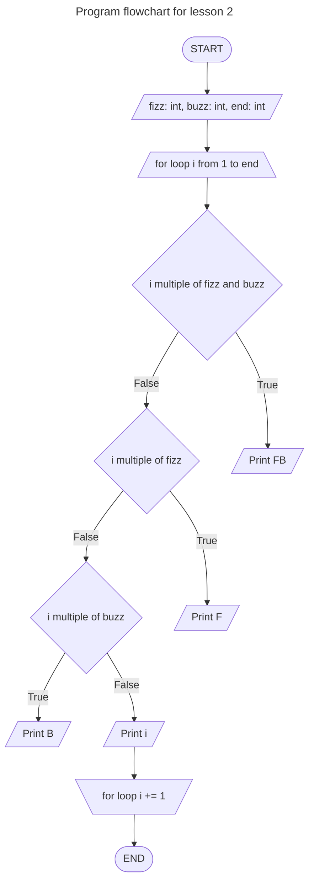

```mermaid
---
title: Program flowchart for lesson 2
---
flowchart TB
    A([START])
    B[/fizz: int, buzz: int, end: int/]
    C[/for loop i from 1 to end\]
    D{i multiple of fizz and buzz}
    F{i multiple of fizz}
    G{i multiple of buzz}
    H[\for loop i += 1/]
    I([END])
    printFB[/Print FB/]
    printB[/Print B/]
    printF[/Print F/]
    printI[/Print i/]
    A --> B
    B --> C
    C --> D
    D --True--> printFB 
    D --False--> F
    F --True--> printF
    F --False--> G
    G --True--> printB
    G --False--> printI
    printI --> H
    H --> I
```